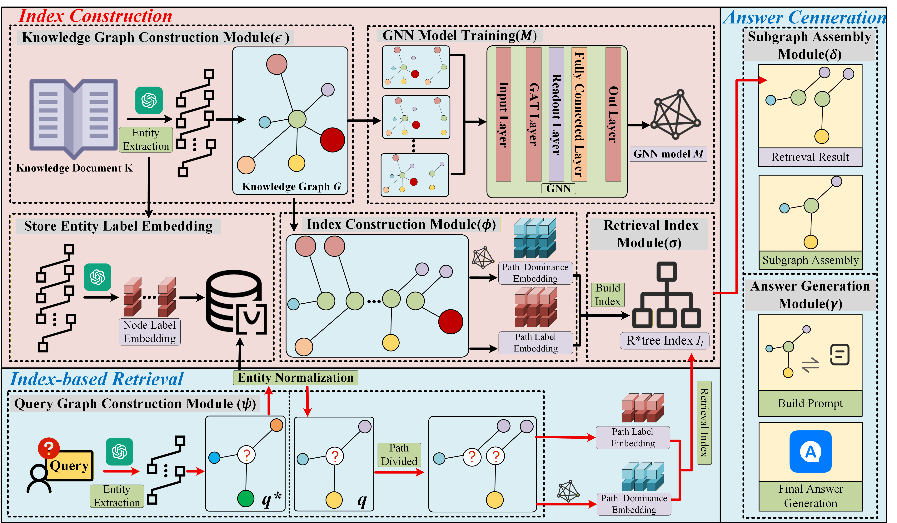
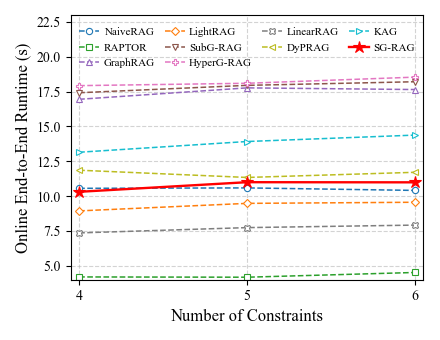

# SG-RAG

**Structure Guided Retrieval-Augmented Generation for Factual Queries**

> Miao Xie, Xiao Zhang, Yi Li, Chunli Lv  
> China Agricultural University, Nanyang Technological University

---

## Overview

Large language models (LLMs) often suffer from **hallucinations**, especially in factual question answering.  
Retrieval-Augmented Generation (RAG) alleviates this issue by retrieving external knowledge, but most existing RAG methods mainly rely on **vector similarity**, which may introduce semantic noise and fail to ensure that the retrieved evidence satisfies **all constraints** in a factual query.

To address this challenge, we introduce a new problem named **Exact Retrieval Problem (ERP)**, where the retrieved evidence must comprehensively satisfy all conditions in a query.  
To solve ERP, we propose **Structure Guided Retrieval-Augmented Generation (SG-RAG)**, which models retrieval as an **embedding-based subgraph matching** task and uses retrieved topological structures to guide answer generation.

We further construct and release **ERQA (Exact Retrieval Question Answering)**, a large-scale benchmark comprising **120,000 fact-oriented QA pairs across 20 domains**, to systematically evaluate ERP.

---

## 1. Motivation

Many real-world factual queries contain **multiple constraints** that must all be satisfied simultaneously.  
For example, in the figure below, the target disease needs to satisfy four conditions at the same time. Traditional RAG methods often fail because they retrieve evidence based on local semantic similarity instead of exact structural matching.

<p align="center">
  
</p>

<p align="center">
  <em>Figure 1: Multi-condition QA example in the Introduction.</em>
</p>

In such scenarios, the answer is correct only if **all constraints are satisfied**.  
This motivates the **Exact Retrieval Problem (ERP)** and the development of **SG-RAG**.

---

## 2. Method

SG-RAG is a structure-guided RAG framework that transforms the retrieval process into an **embedding-based subgraph matching problem**.

The framework consists of three stages:

1. **Index Construction**  
   Construct a knowledge graph from documents, encode path embeddings with a GNN-based dominant embedding model, and build an R\*-Tree index.

2. **Index-based Retrieval**  
   Convert a natural language query into a query graph, normalize entities, decompose it into paths, and retrieve exact candidate paths via structure-aware matching.

3. **Answer Generation**  
   Assemble retrieved paths into exact subgraphs and generate answers with LLMs based on the matched structures.

<p align="center">
  
</p>

<p align="center">
  <em>Figure 2: Overall architecture of SG-RAG.</em>
</p>

---

## 3. ERQA Benchmark

To evaluate ERP, we build **ERQA**, a benchmark specifically designed for factual queries with multiple constraints.

ERQA contains three subsets:

- **FB-ERQA**: 80,000 English encyclopedic QA pairs
- **UD-ERQA**: 10,000 cross-domain English academic QA pairs
- **CM-ERQA**: 30,000 Chinese medical QA pairs

Overall, ERQA contains **120,000 QA pairs across 20 domains**.

### Human Validation on Sampled ERQA Queries

| Split   | Fluency (1–5) | Answerable (%) | Ambiguity (%) ↓ |
|---------|---------------|----------------|-----------------|
| Chinese | 4.7           | 98.0           | 2.0             |
| English | 4.6           | 98.4           | 1.6             |
| Overall | 4.65          | 98.2           | 1.8             |

These results suggest that ERQA queries are generally **natural, answerable, and unambiguous**.

---

## 4. Main Results

We compare SG-RAG with strong baselines including **NaiveRAG, RAPTOR, GraphRAG, LightRAG, SubgraphRAG, HyperGraphRAG, LinearRAG, DyPRAG, KAG**, and **GPT-5.1**.

### Performance on ERQA

| Method         | FB-ERQA Hit@1 | FB-ERQA F1 | CM-ERQA Hit@1 | CM-ERQA F1 | UD-ERQA Hit@1 | UD-ERQA F1 |
|----------------|---------------|------------|---------------|------------|---------------|------------|
| GPT-5.1        | 19.1%         | 18.5%      | 6.5%          | 9.1%       | 10.0%         | 9.6%       |
| NaiveRAG       | 14.8%         | 14.8%      | 14.2%         | 11.1%      | 14.4%         | 13.7%      |
| RAPTOR         | 61.1%         | 60.8%      | 9.5%          | 9.1%       | 10.7%         | 10.5%      |
| GraphRAG       | 61.8%         | 61.8%      | 20.2%         | 16.2%      | 18.8%         | 16.5%      |
| LightRAG       | 20.3%         | 20.2%      | 14.1%         | 11.2%      | 17.6%         | 16.1%      |
| SubgraphRAG    | 33.4%         | 33.7%      | 30.1%         | 31.3%      | 35.7%         | 36.0%      |
| HyperGraphRAG  | 30.6%         | 31.4%      | 21.4%         | 20.1%      | 28.3%         | 28.9%      |
| LinearRAG      | 25.2%         | 25.9%      | 15.9%         | 17.2%      | 23.6%         | 23.6%      |
| DyPRAG         | 28.5%         | 29.1%      | 19.1%         | 21.2%      | 21.5%         | 22.0%      |
| KAG            | 40.7%         | 40.8%      | 30.2%         | 30.4%      | 24.8%         | 25.0%      |
| **SG-RAG**     | **82.5%**     | **82.5%**  | **61.1%**     | **60.8%**  | **61.8%**     | **66.2%**  |

SG-RAG consistently outperforms all baselines across the three subsets of ERQA.  
Compared with the strongest baselines, SG-RAG achieves substantial improvements in both **Hit@1** and **F1**.

### Performance under Varying Numbers of Constraints

| Method         | 4 Constraints Recall | 4 Constraints Hit@1 | 5 Constraints Recall | 5 Constraints Hit@1 | 6 Constraints Recall | 6 Constraints Hit@1 |
|----------------|----------------------|---------------------|----------------------|---------------------|----------------------|---------------------|
| GPT-5.1        | 9.2%                 | 9.0%                | 11.0%                | 10.8%               | 9.1%                 | 9.0%                |
| NaiveRAG       | 16.1%                | 15.2%               | 16.2%                | 15.2%               | 15.4%                | 14.7%               |
| RAPTOR         | 29.6%                | 29.1%               | 29.5%                | 29.3%               | 28.7%                | 28.4%               |
| GraphRAG       | 37.7%                | 36.9%               | 37.6%                | 36.1%               | 36.3%                | 36.2%               |
| LightRAG       | 21.5%                | 20.0%               | 17.7%                | 17.1%               | 17.5%                | 17.0%               |
| SubgraphRAG    | 42.3%                | 41.8%               | 42.5%                | 42.0%               | 39.9%                | 39.5%               |
| HyperGraphRAG  | 35.8%                | 35.4%               | 33.1%                | 32.9%               | 33.3%                | 32.9%               |
| LinearRAG      | 27.1%                | 26.7%               | 26.4%                | 26.2%               | 25.8%                | 24.6%               |
| DyPRAG         | 24.9%                | 24.5%               | 25.2%                | 24.7%               | 22.6%                | 22.3%               |
| KAG            | 32.4%                | 32.3%               | 38.7%                | 37.8%               | 31.6%                | 31.0%               |
| **SG-RAG**     | **72.1%**            | **71.2%**           | **69.1%**            | **68.4%**           | **70.5%**            | **69.1%**           |

SG-RAG remains robust as the number of constraints increases.

### Performance on Natural Questions (NQ)

Although SG-RAG is designed for multi-constraint factual queries, it also generalizes well to single-constraint QA.

| Method    | Precision | Recall | F1     | Hit@1  |
|-----------|-----------|--------|--------|--------|
| NaiveRAG  | 79.51%    | 80.27% | 79.89% | 79.51% |
| GraphRAG  | 85.92%    | 87.88% | 86.89% | 85.92% |
| LightRAG  | 88.41%    | 89.05% | 88.73% | 88.41% |
| **SG-RAG**| **89.33%**| **89.49%** | **89.41%** | **89.33%** |

---

## 5. Efficiency

We further analyze the online end-to-end runtime of SG-RAG under different numbers of constraints.

<p align="center">
  
</p>

<p align="center">
  <em>Figure 3: Online end-to-end runtime comparison.</em>
</p>

SG-RAG remains close to NaiveRAG in runtime and is substantially more efficient than several structure-aware baselines, while delivering much better answer quality.

### Offline Index Construction Time

| Dataset   | GraphRAG | LightRAG | SG-RAG |
|-----------|----------|----------|--------|
| FB-ERQA   | 10h      | 13h      | 14h    |
| UD-ERQA   | 21h      | 23h      | 28h    |
| CM-ERQA   | 8h       | 10h      | 11h    |

SG-RAG introduces only a modest offline index construction overhead compared with other graph-based RAG approaches.

---

## 6. Contributions

- We propose a novel **Exact Retrieval Problem (ERP)** for factual queries requiring all constraints to be satisfied.
- We present **SG-RAG**, a structure-guided retrieval-augmented generation framework based on **embedding-based subgraph matching**.
- We construct and release **ERQA**, a benchmark of **120,000 QA pairs across 20 domains**.
- Extensive experiments show that SG-RAG significantly outperforms strong baselines across datasets and remains robust and efficient.

---

## Citation

If you find this work useful, please cite:

```bibtex
@article{xie2026sgrag,
  title={Structure Guided Retrieval-Augmented Generation for Factual Queries},
  author={Miao Xie and Xiao Zhang and Yi Li and Chunli Lv},
  year={2026}
}
